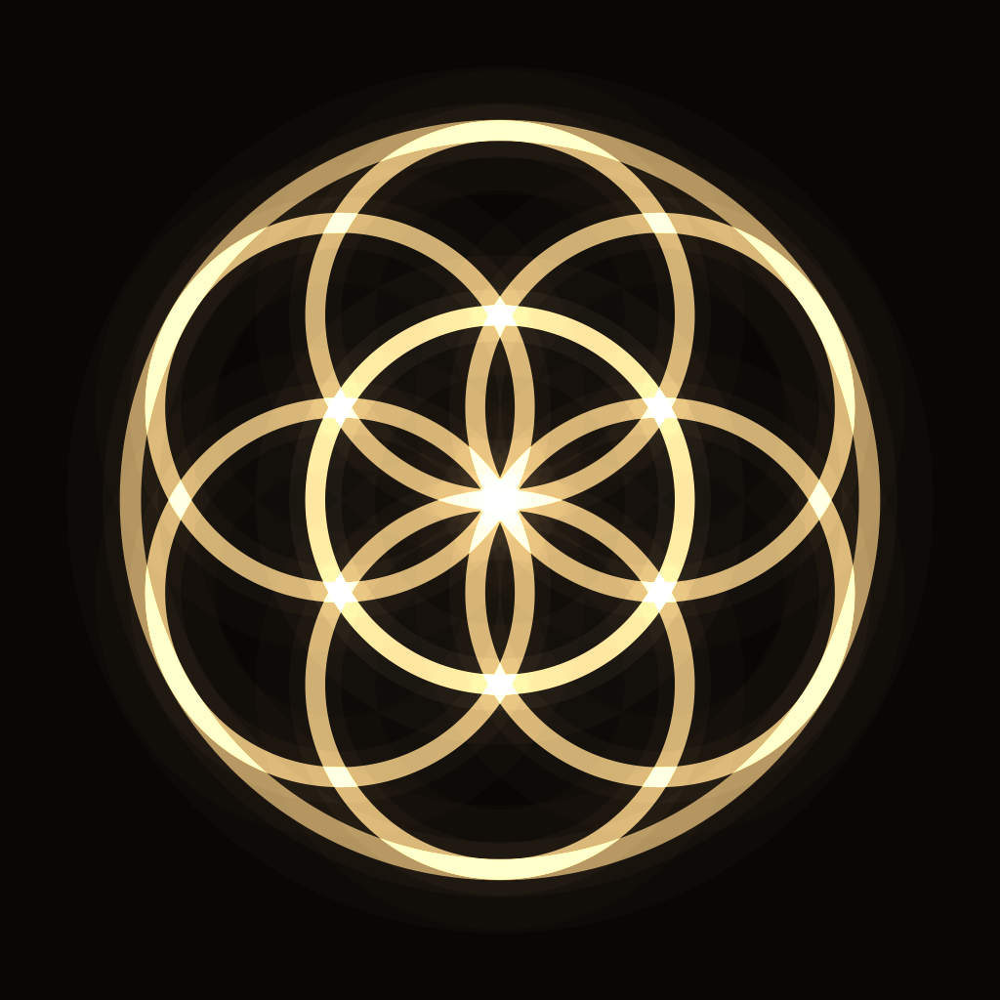

# Athanor

[](https://github.com/michellzappa/athanor/actions/workflows/build.yml)

Generative sacred geometry, in ink on black. A figure draws itself the way it
would be built with compass and straightedge, rests, dissolves, and another one
begins.

A macOS screen saver, an Apple TV app, and an iPhone wallpaper generator, all
three built from one shared geometry core.

## Figures

Eight so far, each generated from a seed rather than replayed from a preset.
Ring counts, step numbers, petal counts, drawing order, palette and pacing all
come from the seed, so a figure you liked is not coming back exactly.

| Figure           | What varies                                                |
| ---------------- | ---------------------------------------------------------- |
| Flower of Life   | two or three rings, trimmed at the boundary or left whole   |
| Metatron's Cube  | orientation, and which of the 78 chords carry the emphasis  |
| Vesica Piscis    | the single classical construction, or a chain of three to six |
| Star polygons    | {n/k} for n up to 19, one to three steps layered            |
| Yantra           | gates, circle bands, lotus counts, and the star at the heart |
| Tree of Life     | the Kircher arrangement, with or without its cut circles    |
| Golden section   | depth of the subdivision, and which way the spiral turns    |
| Phyllotaxis      | seed count, and which Fibonacci arms get traced             |

Five inks, all of them near-black grounds: Bone, Gold Leaf, Verdigris, Indigo,
Ember.

## Requirements

macOS 14 or later to run the screen saver, macOS 15 with Xcode 16 or later to
build it. [XcodeGen](https://github.com/yonaskolb/XcodeGen) owns the Xcode
project, so `Athanor.xcodeproj` is generated and not checked in.

```bash
brew install xcodegen
```

## Install the screen saver

```bash
./Scripts/install-saver.sh
```

Then System Settings, Screen Saver, and scroll to the bottom of the grid, past
the built-in savers. Behind Options: which figures take a turn, pace, line
weight, glow, whether the construction lines show, and which ink.

## Apple TV

`AthanorTV` is an app you launch and leave running. Apple gives third parties no
way into the system screen saver on tvOS, so this is the closest thing. Select
or play/pause on the remote skips to the next figure. Getting it onto the box
needs a paid developer account.

## iPhone wallpapers

`AthanorWallpaper` renders a figure at your device's exact pixel size and saves
it to Photos. iOS does not let an app set a wallpaper itself, so the last step
is yours: Photos, share, Use as Wallpaper.

## Adding a figure

Write one file exposing a `static let kind: FigureKind`, then add it to
`FigureCatalog.all`. Every options screen builds its list from that catalog, so
nothing else needs touching. [AGENTS.md](AGENTS.md) has the details, along with
the invariants worth knowing before you change the renderer.

Pull requests with new figures are welcome. The bar is that the construction be
real geometry rather than a lookalike: something you could follow with a compass
and get the same drawing.

## Licence

MIT. See [LICENSE](LICENSE).
